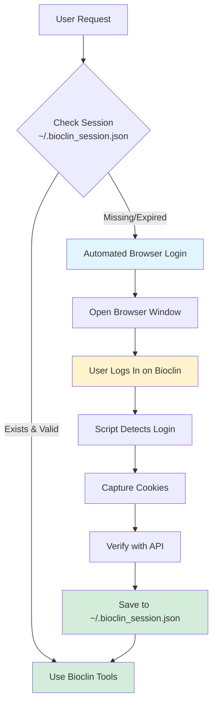
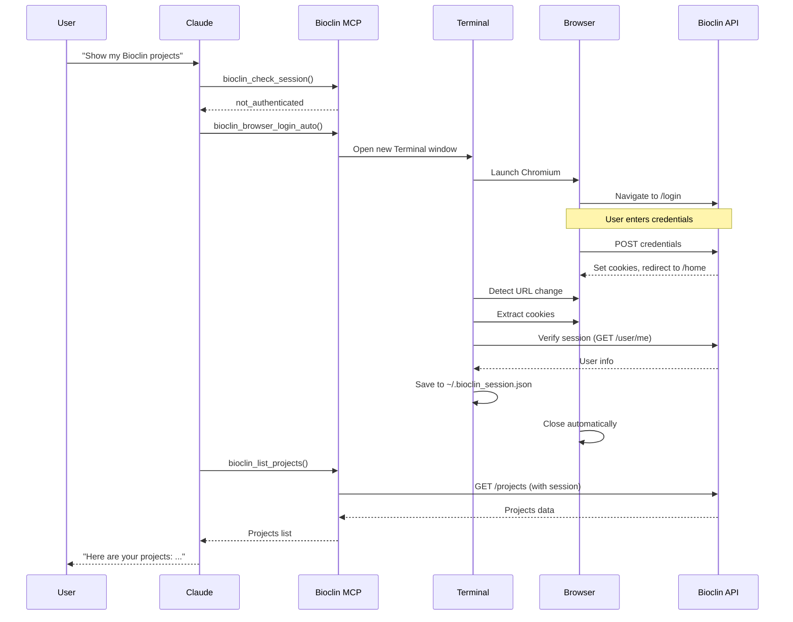
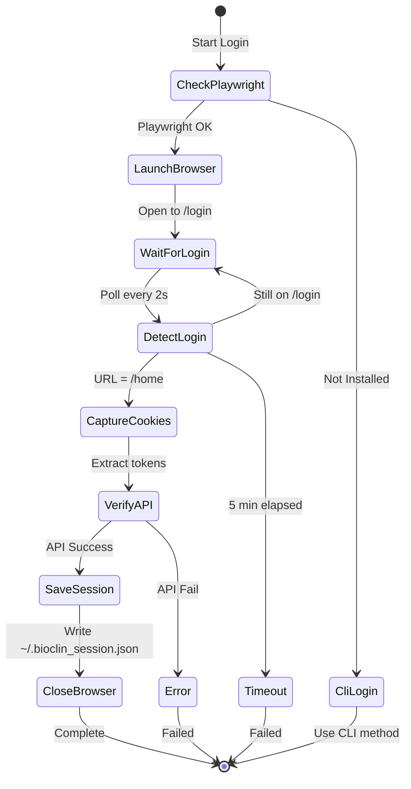

# Authentication Guide

The Bioclin MCP server uses **automated browser-based authentication** with Playwright - no need to expose credentials to the LLM!

## Quick Start

```bash
# Install Playwright
pip install playwright playwright install chromium

# Login
python bioclin_auth.py login

# Choose option 1 (Browser) - a browser will open, log in normally
# Your session will be captured automatically!

# Check status
python bioclin_auth.py status
```

## How It Works

### 1. Standalone Usage

```bash
$ python bioclin_auth.py login
Choose login method:
  1. Browser (recommended) - Automated login with browser window
  2. CLI - Enter credentials securely in terminal

Enter choice [1]: 1
```

A browser opens to Bioclin, you log in, and the script:
- ✅ Detects successful login (URL change to `/home`)
- ✅ Captures session cookies automatically
- ✅ Verifies with API
- ✅ Saves to `~/.bioclin_session.json`
- ✅ Closes browser

### 2. From Claude Desktop

When using the MCP server with Claude Desktop:

**You**: "Show me my Bioclin projects"

**Claude**:
- Checks session with `bioclin_check_session()`
- If not authenticated → calls `bioclin_browser_login_auto()`
- **New Terminal window opens** (on macOS)
- Browser launches to Bioclin login
- You log in
- Session captured automatically
- Claude proceeds with your request!

**Result**: No credentials exposed to LLM ✅

## MCP Tool: `bioclin_browser_login_auto()`

The MCP server includes an automated login tool:

```python
# Claude calls this when authentication is needed
await bioclin_browser_login_auto()
```

### How It Works (Technical)

**On macOS:**
```python
# Opens new visible Terminal window using osascript
terminal_cmd = '''
    tell application "Terminal"
        activate
        do script "python bioclin_auth.py login"
    end tell
'''
```

**On Linux/Windows:**
```python
# Detached subprocess with visible GUI
process = await asyncio.create_subprocess_shell(
    'python bioclin_auth.py login',
    start_new_session=True
)
```

## Session Storage

Sessions are stored securely in `~/.bioclin_session.json`:

```json
{
  "cookies": {
    "access_token": "eyJhbG...",
    "csrf_token": "DbutW3cf...",
    "refresh_token": "eyJhbG..."
  },
  "user": {
    "email": "user@example.com",
    "username": "username",
    "id": "uuid"
  },
  "created_at": "2025-10-23T14:17:13.350142",
  "expires_at": "2025-10-30T14:17:13.350149"
}
```

- **Permissions**: `0o600` (owner read/write only)
- **Expiration**: 7 days
- **Location**: `~/.bioclin_session.json`

## Authentication Methods

### Method 1: Browser (Recommended) ⭐

**Pros:**
- ✅ No credentials to LLM
- ✅ Official Bioclin website
- ✅ Automatic cookie capture
- ✅ Most secure

**Cons:**
- Requires Playwright

```bash
python bioclin_auth.py login
# Choose option 1
```

### Method 2: CLI (Fallback)

**Pros:**
- ✅ No dependencies
- ✅ Works everywhere

**Cons:**
- ❌ Must enter credentials in terminal

```bash
python bioclin_auth.py login
# Choose option 2
# Enter email and password
```

### Method 3: Direct API (Not Recommended)

Only for programmatic use:

```python
import httpx

response = httpx.post(
    "https://bioclin.vindhyadatascience.com/api/v1/identity/login",
    data={"username": email, "password": password}
)
```

## Commands

```bash
# Login
python bioclin_auth.py login

# Check session status
python bioclin_auth.py status

# Logout (clear session)
python bioclin_auth.py logout
```

## Troubleshooting

### Browser doesn't open
```bash
# Check Playwright is installed
pip show playwright

# Install Chromium
playwright install chromium

# Try CLI method instead
python bioclin_auth.py login
# Choose option 2
```

### Session not persisting
```bash
# Check session file exists
ls -la ~/.bioclin_session.json

# Check file contents
cat ~/.bioclin_session.json

# Check status
python bioclin_auth.py status
```

### Terminal window doesn't open (macOS)
```bash
# Test osascript
osascript -e 'tell app "Terminal" to activate'

# Run manually instead
python bioclin_auth.py login
```

### Session expired
```bash
# Sessions expire after 7 days
# Just log in again
python bioclin_auth.py login
```

## Security Features

- 🔒 **No credential exposure** - Enter password only in browser
- 🔒 **Official website** - Login on real bioclin.vindhyadatascience.com
- 🔒 **Secure storage** - Session file has `0o600` permissions
- 🔒 **Auto-expiration** - Sessions expire after 7 days
- 🔒 **HTTPS only** - All communication encrypted
- 🔒 **Token-based** - Only session tokens stored, not passwords

## Requirements

```bash
# Core
pip install httpx

# For automated browser login (recommended)
pip install playwright
playwright install chromium
```

## Platform Support

| Platform | Browser Login | CLI Login | MCP Tool |
|----------|---------------|-----------|----------|
| macOS    | ✅ (Terminal) | ✅        | ✅       |
| Linux    | ✅            | ✅        | ✅       |
| Windows  | ✅            | ✅        | ✅       |

## Example Workflows

### First Time Setup

```bash
# 1. Install dependencies
pip install playwright httpx
playwright install chromium

# 2. Login
python bioclin_auth.py login

# 3. Choose Browser (option 1)
# 4. Browser opens, log in
# 5. Session saved automatically

# 6. Verify
python bioclin_auth.py status
# ✅ Logged in
#    User: username (email@example.com)
#    Expires: 2025-10-30T14:17:13
```

### Using with Claude Desktop

```bash
# 1. Add to Claude config (see README.md)
# 2. Start Claude Desktop
# 3. Ask Claude to use Bioclin
# 4. If needed, Claude triggers browser login
# 5. Log in when browser opens
# 6. Continue working - no more authentication needed!
```

### Session Management

```bash
# Check if logged in
python bioclin_auth.py status

# Logout (e.g., to switch accounts)
python bioclin_auth.py logout

# Login again
python bioclin_auth.py login
```

## Architecture

### Authentication Flow



### Claude Desktop Integration



### Browser Login Sequence



### Cookie Detection

The script monitors for successful login by checking:
1. URL change from `/login` to `/home`
2. Presence of `access_token` cookie
3. Polling every 2 seconds (max 5 minutes)

```python
for i in range(150):  # 5 minutes
    current_url = page.url
    if '/login' not in current_url or 'access_token' in cookies:
        # Login detected!
        break
    await page.wait_for_timeout(2000)
```

## API Reference

### Session File Format

```typescript
{
  cookies: {
    access_token: string,    // JWT token
    csrf_token: string,      // CSRF protection
    refresh_token: string    // Token refresh
  },
  user: {
    email: string,
    username: string,
    id: string              // UUID
  },
  created_at: string,       // ISO timestamp
  expires_at: string        // ISO timestamp (created + 7 days)
}
```

### MCP Tools

```python
# Check authentication
await bioclin_check_session()
# Returns: { status: "authenticated" | "not_authenticated", user: {...} }

# Trigger browser login
await bioclin_browser_login_auto()
# Returns: { status: "login_started", instructions: [...] }

# Logout
await bioclin_logout()
# Returns: { status: 200, message: "Logout successful" }
```

## Contributing

When modifying authentication:
- ✅ Test on macOS, Linux, and Windows
- ✅ Ensure no credentials logged
- ✅ Verify session file permissions (0o600)
- ✅ Test both browser and CLI methods
- ✅ Update this documentation
