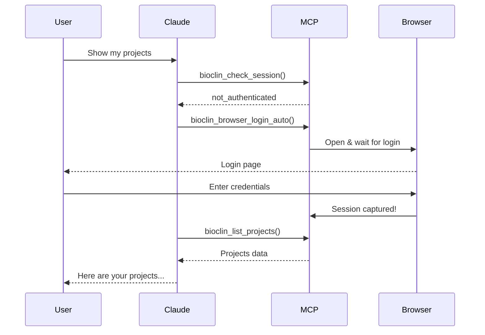

# Bioclin MCP Server 🧬

A Model Context Protocol (MCP) server for the Bioclin bioinformatics API with **secure automated browser authentication**.

> **Key Feature**: Log in via browser - never expose credentials to the LLM! 🔒

## Quick Start

```bash
# 1. Install
git clone https://github.com/vindhyadatascience/bioclin-mcp.git
cd bioclin-mcp
pip install fastmcp httpx playwright
playwright install chromium

# 2. Authenticate
python bioclin_auth.py login
# Browser opens → log in → done!

# 3. Run server
fastmcp run bioclin_fastmcp.py

# 4. Or use convenience script
./run_bioclin.sh
```

## Features

- 🔐 **Secure Browser Login** - Automated with Playwright, no credentials to LLM
- ⚡ **46+ API Tools** - Full Bioclin API coverage
- 🤖 **Claude Desktop Ready** - Seamless integration
- 💾 **Session Management** - 7-day persistence
- 🎯 **FastMCP** - Modern, fast MCP implementation

## Authentication

### Option 1: Browser Login (Recommended) ⭐

```bash
$ python bioclin_auth.py login

Choose login method:
  1. Browser (recommended) - Automated login
  2. CLI - Enter credentials in terminal

Enter choice [1]: 1

🌐 Bioclin Automated Browser Login
✓ Browser window opens
✓ You log in on official Bioclin website
✓ Session captured automatically
✓ Browser closes
✅ Done! Session saved for 7 days
```

**Why this is secure:**
- ✅ Credentials entered directly on bioclin.vindhyadatascience.com
- ✅ Never exposed to LLM or stored in plaintext
- ✅ Only session tokens saved locally

### Option 2: CLI Login

```bash
$ python bioclin_auth.py login
Enter choice [2]: 2
Email: your@email.com
Password: ••••••••
✅ Login successful!
```

**[Full Authentication Guide →](AUTHENTICATION.md)**

## Claude Desktop Setup

### 1. Add to Configuration

Edit your Claude Desktop config:

**macOS**: `~/Library/Application Support/Claude/claude_desktop_config.json`

**Windows**: `%APPDATA%/Claude/claude_desktop_config.json`

```json
{
  "mcpServers": {
    "bioclin": {
      "command": "fastmcp",
      "args": ["run", "/absolute/path/to/bioclin-mcp/bioclin_fastmcp.py"]
    }
  }
}
```

### 2. Restart Claude Desktop

### 3. Test It

Ask Claude:
- *"Do I have an active Bioclin session?"*
- *"Show me my Bioclin projects"*

If not authenticated, Claude will trigger the browser login automatically!



## Available Tools

### Authentication & Session
- `bioclin_check_session()` - Check if authenticated
- `bioclin_browser_login_auto()` - Automated browser login
- `bioclin_login()` - Direct credential login (fallback)
- `bioclin_logout()` - Clear session
- `bioclin_token_validate()` - Validate token
- `bioclin_token_refresh()` - Refresh token

### User Management (11 tools)
Create, read, update users | Admin operations | Password recovery

### Organization Management (6 tools)
Create orgs | Manage members | Switch active org

### Project Management (8 tools)
Create projects | List projects | Configure parameters

### Run Management (5 tools)
Create runs | Track status | View results

### Analysis Types & Parameters (8 tools)
Define reusable analysis types | Configure parameters

### Google Cloud Storage (3 tools)
Generate signed URLs | Download files | Access reports

**Total: 46+ tools** | [See complete list in code →](bioclin_fastmcp.py)

## Usage Examples

### Example 1: First Time Use

```
You: "I need to work with Bioclin"

Claude: Let me check if you're authenticated...
        [Checks session - not authenticated]
        I'll start the automated login process.
        [Terminal window opens with browser]

You: [Log in via browser]

Claude: Perfect! You're now authenticated.
        What would you like to do with Bioclin?

You: "Show me my projects"

Claude: [Lists all your projects with details]
```

### Example 2: Create and Run Analysis

```
You: "Create a project called 'RNA-Seq Study'"

Claude: [Creates project]
        Created project "RNA-Seq Study" (ID: abc-123)

You: "Create a run for this project"

Claude: [Creates run]
        Run created successfully. Status: PENDING

You: "What's the status now?"

Claude: [Checks run status]
        Status: RUNNING - Your analysis is in progress
```

## File Structure

```
bioclin-mcp/
├── README.md                    # This file
├── AUTHENTICATION.md            # Detailed auth guide with diagrams
├── DOCKER.md                    # Docker deployment guide
│
├── bioclin_fastmcp.py          # Main MCP server (FastMCP)
├── bioclin_auth.py             # Authentication script (Playwright)
├── auto_browser_auth.py        # Standalone auth script
├── run_bioclin.sh              # Convenience launcher
│
├── bioclin_mcp_server.py       # Legacy MCP server
├── bioclin_schemas.py          # Pydantic schemas
└── requirements.txt            # Python dependencies
```

## Requirements

```txt
fastmcp>=0.2.0
httpx>=0.24.0
playwright>=1.40.0      # For automated browser login
pydantic>=2.0.0
```

## Session Management

Sessions are stored in `~/.bioclin_session.json`:

```json
{
  "cookies": { "access_token": "...", "csrf_token": "...", "refresh_token": "..." },
  "user": { "email": "user@example.com", "username": "username", "id": "uuid" },
  "created_at": "2025-10-23T14:17:13",
  "expires_at": "2025-10-30T14:17:13"
}
```

- **Permissions**: `0o600` (owner-only read/write)
- **Expiration**: 7 days
- **Commands**: `status`, `login`, `logout`

## Environment Variables

```bash
# Optional: Override default API URL
export BIOCLIN_API_URL="https://your-instance.com/api/v1"
```

Default: `https://bioclin.vindhyadatascience.com/api/v1`

## Troubleshooting

### Browser doesn't open

```bash
# Check Playwright
pip show playwright
playwright install chromium

# Or use CLI method
python bioclin_auth.py login  # Choose option 2
```

### Session expires

```bash
# Sessions last 7 days - just log in again
python bioclin_auth.py login
```

### MCP not connecting

```bash
# Verify config path is absolute
# Check Claude Desktop config syntax
# Restart Claude Desktop completely
```

**[More troubleshooting →](AUTHENTICATION.md#troubleshooting)**

## Docker Deployment

```bash
# Build
docker build -t bioclin-mcp:latest .

# Run
docker run -it --rm bioclin-mcp:latest
```

**[Full Docker guide →](DOCKER.md)**

## Security

- 🔒 Credentials entered only on official Bioclin website
- 🔒 Never logged or exposed to LLM
- 🔒 Session file secured with `0o600` permissions
- 🔒 Auto-expiration after 7 days
- 🔒 HTTPS-only API communication
- 🔒 Token-based authentication (no password storage)

## Contributing

Contributions welcome! Please:
- Maintain security best practices
- Add tests for new features
- Update documentation
- Follow existing code style

## Documentation

- **[AUTHENTICATION.md](AUTHENTICATION.md)** - Complete auth guide with Mermaid diagrams
- **[DOCKER.md](DOCKER.md)** - Docker deployment
- **[bioclin_fastmcp.py](bioclin_fastmcp.py)** - Source code with tool definitions

## Version

**v1.1.0** - Automated Browser Authentication

### Changelog

**v1.1.0** (2025-10-23)
- ✨ Automated browser-based authentication with Playwright
- ✨ New `bioclin_browser_login_auto()` MCP tool
- ✨ macOS Terminal.app integration for visible GUI
- 🔒 Enhanced security - no credential exposure to LLM
- 🎯 Seamless Claude Desktop integration
- 📝 Comprehensive documentation with Mermaid diagrams

**v1.0.0** (Initial Release)
- 🎉 Initial Bioclin MCP server
- 46+ API tools
- FastMCP implementation
- Basic authentication support

## License

MIT License

## Support

- **Issues**: [GitHub Issues](https://github.com/vindhyadatascience/bioclin-mcp/issues)
- **Bioclin API**: Contact your Bioclin administrator
- **MCP Protocol**: https://modelcontextprotocol.io

---

Made with ❤️ for bioinformatics research

**🔒 Secure by Design** | **⚡ Fast & Modern** | **🤖 Claude Desktop Ready**
